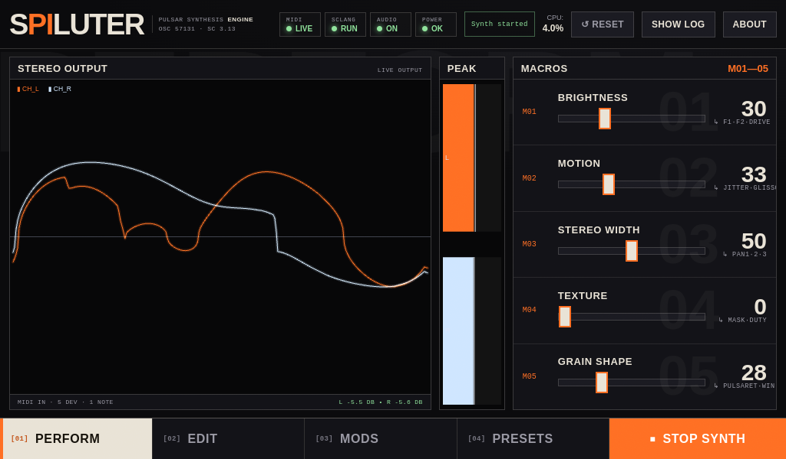

# Spaluter Desktop (Electron + SuperCollider)

Cross-platform desktop wrapper for the `spaluter_supercollider.scd` patch.

## What it does

- Launches `sclang`
- Boots `scsynth`
- Loads the Spaluter patch
- Starts the synth
- Provides a non-SuperCollider UI (HTML/CSS/JS in Electron)
- Sends parameter changes via OSC
- Handles MIDI CC mappings plus MIDI Note On/Off pitch+gate control while respecting the currently selected Gate Mode (no forced mode switching)
- In **MIDI-like Gate Mode**, each incoming Note On retriggers active internal LFOs
- Startup order is enforced as: check SuperCollider -> install if missing -> start SuperCollider -> start synth -> start GUI

## The Perform screen

The Perform screen is the default, always-on view on the 1024×600 Raspberry Pi touchscreen. It is the live "mixer" of the instrument: a large output scope on the left, a stereo peak meter in the middle, and the five performance **macros** on the right.



### Header (top row)

- **SPILUTER wordmark** — the "PI" is tinted in the shock orange accent.
- **Status chips** — live health of the runtime: `MIDI` (input device link), `SCLANG` (language runtime), `AUDIO` (output engine), and `POWER` (Pi under-voltage/throttle state). Green = healthy.
- **Status label** — the current engine status (e.g. `Synth started`); wraps to two lines for longer messages.
- **CPU** — current CPU load, with the label on top and the value (bold) beneath.
- **Reset / Show Log / About** — utility buttons. The bottom-right **Stop Synth** button (red) is the emergency stop.

### Stereo Output (hero scope)

A live oscilloscope of the synthesized output. **CH_L** is drawn in shock orange and **CH_R** in pale ice-blue, each with a soft bloom. The horizontal centre line is the zero axis. The footer shows the active MIDI input summary. The scope only renders while Perform is on screen, to keep CPU low on the Pi.

### Peak meter

Two vertical bars showing the post-output peak level for the **L** (orange) and **R** (ice-blue) channels, with peak-hold. The dB readout (`L -x.x dB · R -x.x dB`) is shown in the scope footer.

### Macros (the performance controls)

The **Macros** panel is the heart of live performance. Each of the five macros is a single fader that drives **several underlying synth parameters at once**, so one gesture sweeps a whole musical dimension instead of a single value. Each lane shows: the macro slot id (`M01`–`M05`), the macro name, the fader, the current value (`0`–`100`), and a small mono-font caption listing the parameters it groups (prefixed with `↳`). The faint number behind each lane is the slot index.

Moving a macro from 0→100 interpolates every target parameter across the listed range. The five macros are:

| Slot | Macro | Underlying parameters (0 → 100) | What it does |
| --- | --- | --- | --- |
| **M01** | **Brightness** | `drive` (1 → 3.2), `formant2` (200 → 1400 Hz), `formant3` (400 → 2600 Hz) | Opens the upper formants and pushes drive for a brighter, more present timbre. |
| **M02** | **Motion** | `timingJitter` (0 → 0.5), `glisson` (0 → 0.5) | Introduces per-grain timing jitter and glissando, adding rhythmic and pitch movement. |
| **M03** | **Stereo Width** | `pan2` (0 → 1), `pan3` (0 → -1) | Spreads the formant streams to opposite sides of the stereo field for a wider image. |
| **M04** | **Texture** | `maskAmount` (0 → 0.9), `duty` (0.5 → 0.12) | Increases stochastic grain masking and narrows the duty cycle for a grainier, sparser texture. |
| **M05** | **Grain Shape** | `pulsaret` (0 → 6), `window` (0 → 5) | Morphs the pulsaret waveform and the grain window, reshaping the fundamental grain. |

Macros write directly to the same parameters exposed on the Edit and Mods screens, so a macro move is reflected everywhere (and is also a valid target for MIDI CCs). The grouped parameter set for each macro is defined by `MACRO_TARGETS` in `renderer/renderer.js`.

### Bottom navigation

`[01] Perform · [02] Edit · [03] Mods · [04] Reverb · [05] Presets` switch between the five screens; the orange **Stop Synth** button on the far right is the held emergency stop.

## The Mods screen

The Mods screen hosts 16 internal LFOs with per-LFO shape, rate, depth, target routing, and optional MIDI clock sync + div/mult.

To make modulation audibility easier to verify, the UI now includes:

- **Per-LFO target delta panel** (inside each LFO card): shows `Base → Live` target value plus instantaneous `ΔLFO` and summed `Σ` modulation.
- **Impact matrix** (above LFO cards): compact row-per-LFO view showing current target and signed modulation amount.
- **Edit-screen live markers**: when an LFO targets a parameter with a slider, a live marker overlays that slider to show the effective modulated value in real time while preserving the base setting.

## The VERB/DLY screen

The VERB/DLY screen hosts a Mutable Instruments *Clouds*-style reverb plus a lightweight 4-tap rhythmic delay. Both run in a dedicated, persistent effect synth (`\spaluterReverb`) placed **after** the engine in the SuperCollider node order, so the tail keeps ringing while voices are gated/released. The Perform scope and peak meter remain pre-effect (they read the engine output directly).

The controls are plain faders, styled like the Edit screen:

| Control | Param | Range | Default | What it does |
| --- | --- | --- | ---: | --- |
| **Mix** | `revWet` | 0 – 1 | 0.0 | Reverb dry/wet blend. The FX node is fully bypassed only when **both** `revWet` and `dlyWet` are 0. |
| **Decay** | `revTime` | 0 – 0.95 | 0.6 | Feedback-loop gain — longer values give longer tails. Capped below self-oscillation. |
| **Diffusion** | `revDiff` | 0 – 1 | 0.7 | Smear/density of the input diffuser and in-loop allpass. |
| **Damping** | `revDamp` | 0 – 1 | 0.5 | High-frequency absorption inside the loop (higher = darker). |
| **Shimmer** | `revShimmer` | 0 – 1 | 0.0 | Octave-up branch injected into the reverb feedback network for classic shimmer bloom. |
| **Movement** | `revMod` | 0 – 1 | 0.3 | Delay-time modulation depth on the loop delays to de-metal and animate the tail. |
| **Pre-delay** | `revPreDelay` | 0 – 250 ms | 0 | Delay before the reverb onset. |
| **Low Cut** | `revLowCut` | 20 – 1000 Hz | 20 | High-pass filter on the reverb wet signal. |
| **Delay Mix** | `dlyWet` | 0 – 1 | 0.0 | 4-tap delay dry/wet blend. |
| **Delay Feedback** | `dlyFeedback` | 0 – 0.88 | 0.35 | Tail length for repeated taps (capped for stability). |
| **Tap Spread** | `dlySpread` | 0 – 1 | 0.45 | Spacing between the 4 taps; higher values widen the rhythm. |
| **Base Time** | `dlyTimeMs` | 20 – 2000 ms | 320 | Delay base time when Sync is in Free ms mode. |
| **Sync** | `dlySyncMode` | `Free ms` / `MIDI Clock` | Free ms | Chooses free time or MIDI-clock-locked timing. |
| **Clock Ratio** | `dlyClockRatio` | `/16 … x16` | x1 | Divides the beat length when Sync is MIDI Clock: `/N` lengthens (slows) the delay, `xN` shortens (speeds) it. |

Effect params are sent over the same `/spaluter/set` path as every other parameter; the runtime routes `rev*` and `dly*` keys to the effect synth. They are captured and restored by presets like any other control.

## Default MIDI channel values (CC mappings)

| Parameter | Default MIDI CC |
| --- | ---: |
| amp | 7 |
| drive | 71 |
| pulsaret | 20 |
| window | 21 |
| duty | 22 |
| dutyMode | 23 |
| formantCount | 24 |
| formantTrack | 25 |
| formant1 | 26 |
| formant2 | 27 |
| formant3 | 28 |
| pan1 | 29 |
| pan2 | 30 |
| pan3 | 31 |
| maskMode | 32 |
| perFormantMask | 33 |
| maskAmount | 34 |
| ampJitter | 35 |
| timingJitter | 36 |
| glisson | 37 |
| burstOn | 38 |
| burstOff | 39 |
| gateMode | 40 |
| voiceCount | 41 |
| chordType | 42 |
| basePitch | 43 |
| attackMs | 44 |
| releaseMs | 45 |
| glideMs | 46 |
| useSample | 47 |
| sampleRate | 48 |
| revWet | 49 |
| revTime | 50 |
| revDamp | 51 |
| revDiff | 52 |
| revMod | 53 |
| revPreDelay | 54 |
| revLowCut | 55 |
| revShimmer | 56 |
| dlyWet | 57 |
| dlyFeedback | 58 |
| dlySpread | 59 |
| dlyTimeMs | 60 |
| dlySyncMode | 61 |
| dlyClockRatio | 62 |

## Requirements

- Node.js 18+
- SuperCollider is auto-detected on startup (`sclang` in `PATH` or `SCLANG_PATH`)
- If missing, startup attempts platform package-manager install:
  - macOS: Homebrew
  - Windows: winget (fallback choco)
  - Linux / Raspberry Pi: apt (fallback dnf/pacman/zypper)
  - You may be prompted for administrator privileges by your package manager

## Run

```bash
npm install
npm start
```

Note: this repo’s launcher clears `ELECTRON_RUN_AS_NODE` automatically before spawning Electron, because some shells/environments set it and break app startup.

## Platforms

- macOS: supported
- Windows: supported
- Linux / Raspberry Pi 4: supported

## Build installers

Installer artifacts are written to `installers/`.

```bash
npm install
npm run build:mac
npm run build:win
npm run build:pi
```

Or build all in one go:

```bash
npm run build:installers
```

Installer behavior:

- macOS build script outputs both Intel (`x64`) and Apple Silicon (`arm64`) installers.
- macOS (`.pkg` postinstall): creates `/usr/local/bin/spaluter-desktop` symlink to the app binary.
- Windows (`NSIS`): adds install directory to machine `PATH`.
- Raspberry Pi / Linux ARM64 (`.deb` postinst): creates `/usr/local/bin/spaluter-desktop` launcher that prefers `pw-jack`.
- Raspberry Pi / Linux ARM64 (`.deb` postinst): installs `/usr/local/bin/spaluter-linux-startup`, invoked on each launch to start audio services and probe MIDI/audio/SuperCollider prerequisites.
- Raspberry Pi / Linux ARM64 (`.deb` postinst): installs `/usr/local/bin/spaluter-rpi-setup` and starts it automatically in the background at install-time.
- All platforms: package app/runtime files and warn if `sclang` is not installed.

## OSC bridge details

Electron sends to `127.0.0.1:57130`, runtime replies to `127.0.0.1:57131`.

Runtime OSC endpoints:

- `/spaluter/start`
- `/spaluter/stop`
- `/spaluter/reset`
- `/spaluter/set` with `[paramName, value]`
- `/spaluter/load-sample` with `[absoluteSamplePath]`
- `/spaluter/quit`

Sample browsing defaults to `/spaluter/samples/` (intended USB mount path). You can change the folder in the UI and refresh the file list.

## MIDI handling architecture

The MIDI hot path is optimised for sustained high-rate CC traffic (e.g. simultaneous fader sweeps on Intech Grid + Pisound DIN) without losing resolution or backing up the IPC queue. See `midi-fix-plan.md` for the full design history and `midi-optimization-claude.md` / `midi-optimization-codex.md` for the analyses that drove it.

Flow:

1. Web MIDI dispatches to the renderer's `handleMidiMessage`.
2. CC values stage into an ordered `pendingCcEvents` array (every value preserved — no per-param coalescing).
3. A `queueMicrotask` drain flushes the staged batch via `setParamMany` (fire-and-forget IPC; never `invoke`). Canvas redraws are coalesced separately on rAF.
4. Main bundles the batch into a single OSC packet and sends it to `127.0.0.1:57130`.
5. `OSCdef(\spaluterSet)` in `sc/runtime.scd` calls `~spaluter.set` inline (no `.defer`), so updates reach scsynth without language-frame quantization.

A `[MIDI-DIAG]` line lands in `~/.local/state/spaluter/start.log` every second on Linux/Pi, showing `raw/s set/s peak/s compress% batches/s maxBatch inflight inflight-peak`. Use it to confirm the pipeline is healthy:

- `inflight-peak` should stay at 0 or 1 — anything higher means IPC backpressure.
- Negative `compress` is expected when CCs map to multiple params.
- A nonzero `inflight-peak` plus a rising `inflight` is the early-warning sign of the original crash mode.

### Raspberry Pi system tuning

For low jitter on Patchbox OS, the following are recommended (and applied automatically on the deployed device):

- CPU governor pinned to `performance` (systemd one-shot, `/etc/systemd/system/cpufreq-performance.service`).
- `vm.swappiness = 10` in `/etc/sysctl.d/60-spaluter-audio.conf`.
- `triggerhappy.service` and `triggerhappy.socket` disabled.
- udev rule at `/etc/udev/rules.d/65-intech-grid.rules` creating `/dev/intech-grid` for stable USB device identity.

## Troubleshooting

- If the app opens but synth never starts:
  - Check the in-app log panel for `Failed to launch sclang`.
  - Check for startup lines:
    - `[BOOT] runtime: ...`
    - `[BOOT] patch: ...`
    - `[STATUS] Starting sclang (...)`
  - Ensure `sclang` is installed and available in PATH.
  - Or launch with explicit path:
    - macOS/Linux:
      ```bash
      SCLANG_PATH=/absolute/path/to/sclang npm start
      ```
    - Windows (PowerShell):
      ```powershell
      $env:SCLANG_PATH="C:\Path\To\sclang.exe"; npm start
      ```
- Runtime listens for OSC on `127.0.0.1:57130` and reports status back to app on `127.0.0.1:57131`.
- If you see `Server 'localhost' exited` right after boot:
  - This is usually an audio device/sample-rate mismatch.
  - In SuperCollider IDE, verify server boots with your current default output device.
  - On macOS, check Audio MIDI Setup for consistent output sample rate.
- Raspberry Pi one-shot dependency setup (manual rerun):
  - `sudo /usr/local/bin/spaluter-rpi-setup --force`
- Linux startup bootstrap (manual run):
  - `/usr/local/bin/spaluter-linux-startup`
